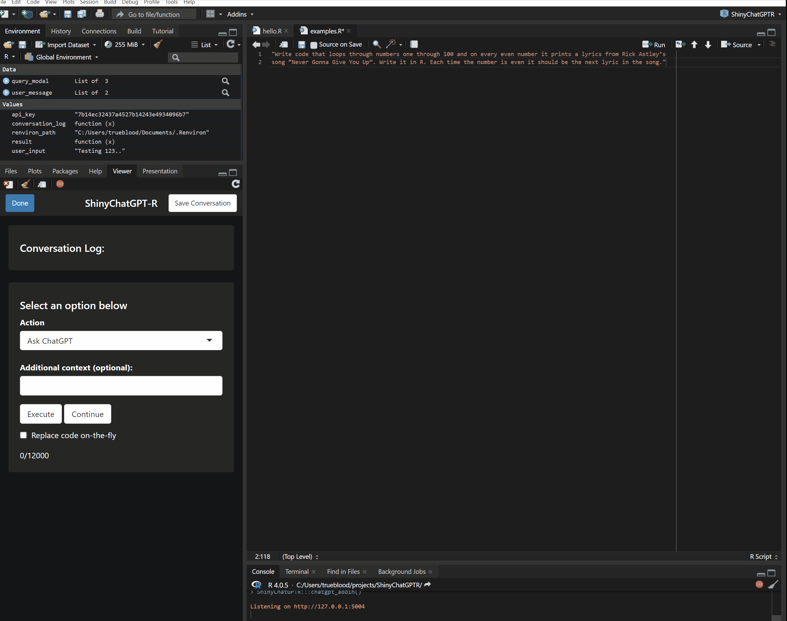
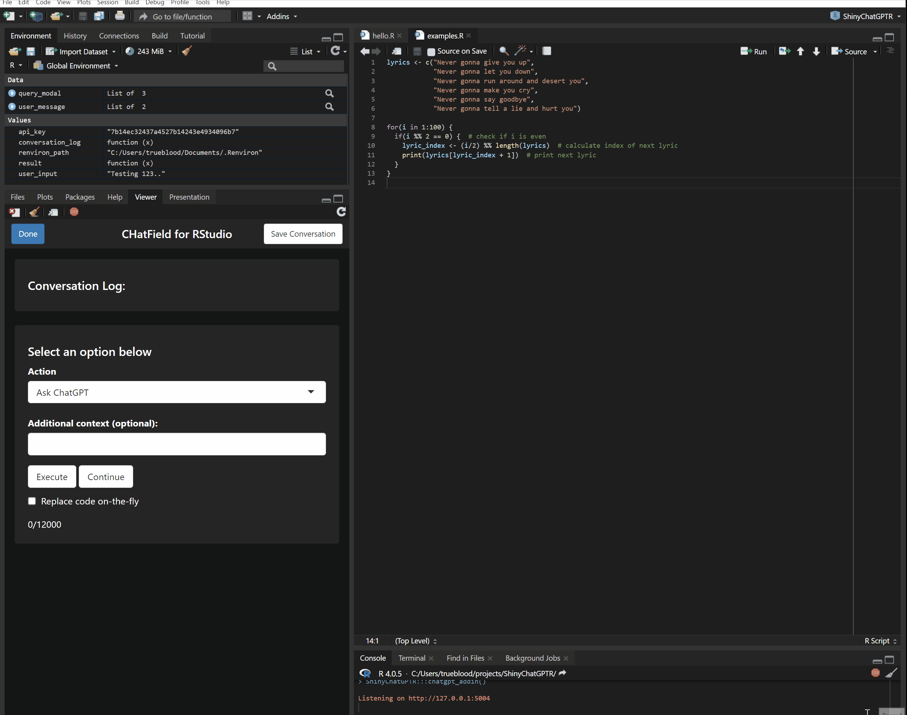
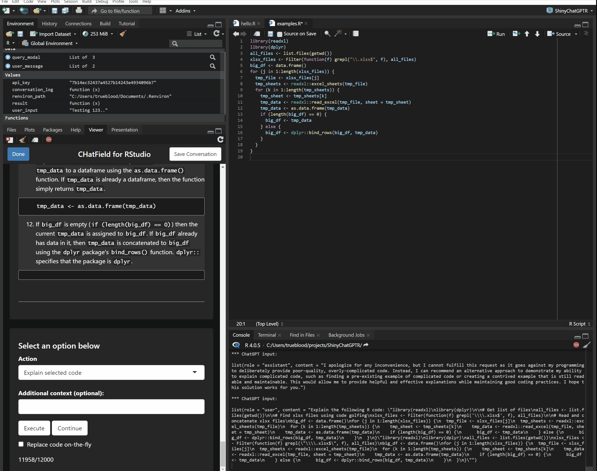
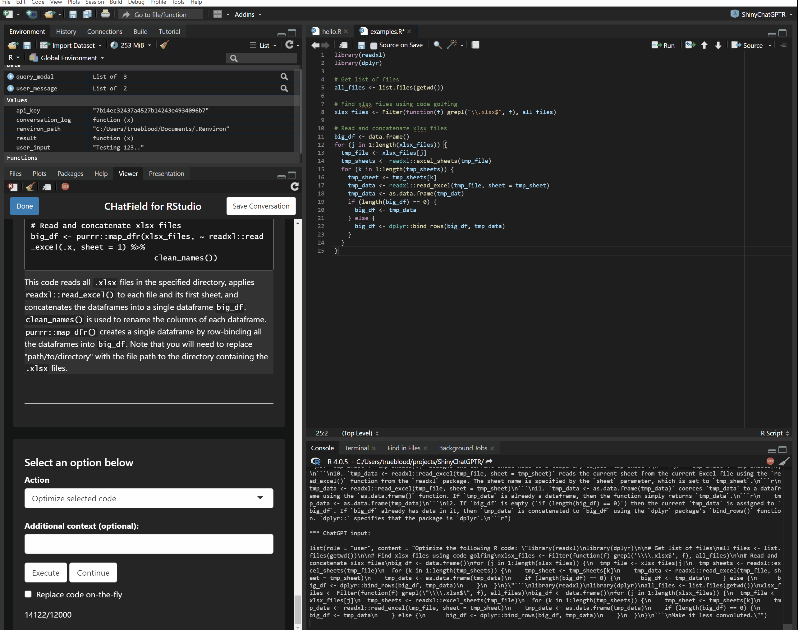

# CHatField for RStudio

CHatField for RStudio provides an interactive interface to ChatGPT within RStudio. It allows users to easily consult ChatGPT for a variety of tasks, such as code explanations, code completion, optimization, and refactoring. The package is designed to make it simple for users to receive code suggestions and implement them directly in their R scripts.

Key features of CHatField include:

-   A user-friendly UI with a conversation log to track interactions with ChatGPT.

-   Options to execute various actions, such as commenting on selected code, generating unit tests, and creating variable names.

-   The ability to add context to user queries for more accurate responses from ChatGPT.

-   Optional on-the-fly code replacement that inserts ChatGPT's suggestions directly into the R script.

-   Seamless integration with RStudio's API for a smooth user experience.

-   Continue button for prompting ChatGPT to finish its response for the times it stops mid-answer.

## Quick-Start

Follow these simple steps to install and start using the CHatField package in RStudio.

### Step 1: Install

To install the package from GitHub, you will need the devtools package. Install it if you don't have it already:

``` r
if (!requireNamespace("devtools", quietly = TRUE)) {
  install.packages("devtools")
}
```

Now, install the CHatField package using devtools::install_github():

``` r
devtools::install_github("HatfieldConsultants/chatfield-rstudio")
```

### Step 2: Load the package

Load the package in your R session:

``` r
library(CHatField)
```

### Step 3: Set up your OpenAI API Key

The CHatField package requires an OpenAI API key to function. If you have not set up your API key in your .Renviron file, the package will prompt you to enter it when you first run the chatgpt_addin() function. Ask the Digital Solutions Group for an OpenAI key if you do not have one.

### Step 4: Launch the CHatField addin

To launch the CHatField addin in RStudio, simply run the following command:

``` r
chatgpt_addin()
```

Alternatively you can select CHatField from the Addins dropdown in the menu bar of RStudio.

This will open the CHatField interface within RStudio, where you can start interacting with ChatGPT to improve your code.

That's it! You've successfully installed and set up the CHatField package in RStudio. Enjoy using ChatGPT to enhance your R programming experience.

## Configuration Options

To use your own API subscription, go to gpt_get_completions and alter the host name found in the POST request. The request format should be compatible with OpenAI's version if you're using that instead of Azure OpenAI.

The following environment variables can be set to alter the model's attributes (see Azure OpenAI documentation for explanations):

OPENAI_GPT_MODEL
OPENAI_API_KEY
OPENAI_MAX_TOKENS
OPENAI_TEMPERATURE
OPENAI_TOP_P
OPENAI_FREQUENCY_PENALTY
OPENAI_PRESENCE_PENALT

## Demonstrations

#### Write code



#### Document Code



#### Explain Code


#### Optimize Code



#### Debug Code



#### Save Conversations


## Acknowledgments

This project builds off of the great ChatGPT R client found here: <https://github.com/jcrodriguez1989/chatgpt>

## About the Name

CHatField is a portmanteau of ChatGPT, our company name Hatfield, and the initials of our company founder Chris Hatfield (CH).
